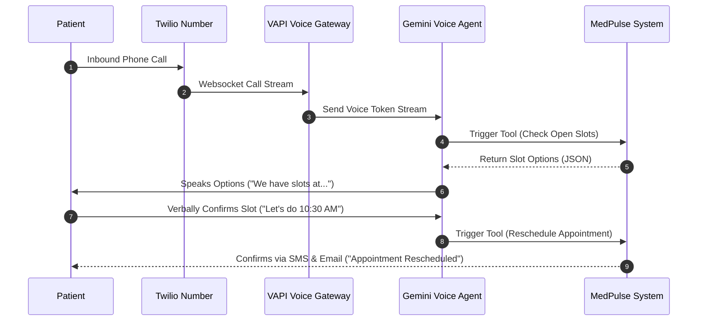

# 🏥 MedPulse AI — Enterprise Smart Clinic & Practice Management Platform

MedPulse AI is a full-stack, enterprise-grade clinical booking, triage, and automated follow-up platform. Built with **FastAPI (async)**, **React 18 + TypeScript**, **SQLite / PostgreSQL**, **Redis**, **Celery**, and **Google Gemini 3.5/3.6 AI**, it features automated clinical workflows, dynamic scheduling, doctor accountability engines, and AI-driven triage and history summarization.

---

## 🌟 Key Features & Standout Differentiators

* 🛡️ **Zero Double-Booking Engine**: Implements serialized check queries on SQLite and database-level pessimistic locking (`SELECT FOR UPDATE SKIP LOCKED` on PostgreSQL) combined with a **5-Minute Temporary Slot Hold** TTL mechanism.
* 🤖 **AI Pre-Visit Triage Summary**: Analyzes patient symptoms using Gemini, outputting structured JSON with `urgency_level` (`LOW`, `MEDIUM`, `HIGH`), chief complaint summary, 2-3 specific clinical questions for the physician, and red flags.
* 📋 **Gemini AI Longitudinal History & Cross-Specialty Context**: Provides doctors with a clinical briefing containing:
  - **Category A**: Specialty-specific longitudinal history.
  - **Category B**: Cross-specialty medical context (checking for systemic interactions).
  - **Category C**: Triage comparisons against the timeline and follow-up guidance.
* 📝 **AI Post-Visit Consultation Notes**: Extracts structured daily medication reminders from free-text notes and translates clinical findings into clear patient-friendly guidelines.
* 💊 **Smart Grouped Medication Alerts**: Groups concurrent daily reminders into a single, clean consolidated email instead of sending multiple spammy notifications.
* 🔔 **Live In-App Notification Bell**: Active polling system with unread badges and quick-redirect navigation links for appointment updates, admin notes, and alerts.
* ⚖️ **Clinical Governance & Roster Accountability**:
  - **AI-Driven Demerit Points & Suspension**: Automatic points assigned to doctors who cancel confirmed appointments based on triage urgency and slot details. Suspension blocks dashboard access when demerits $\ge 10$.
  - **Admin Command Center**: Reassignment tools that filter and offer active, non-suspended, conflict-free substitute doctors. Prevents doctors from cancelling admin-reassigned appointments.
  - **Overdue Cleanup Daemon**: Celery Beat sweep marks unstarted, completed-slot appointments as stale, cancels them, and penalizes the doctor.

---

## 🛠️ Technology Stack

| Layer | Technologies |
| --- | --- |
| **Backend Framework** | Python 3.11+, FastAPI (Async), Pydantic v2 |
| **Database & ORM** | SQLite / PostgreSQL, Async SQLAlchemy 2.0, Alembic |
| **Task Queue & Broker** | Redis 7, Celery 5.3, Celery Beat |
| **AI / LLM Integration** | Google Gemini 3.5/3.6 Flash (`google-genai`), Exponential Retry & Fallback |
| **Notifications & OAuth** | `fastapi-mail` (SMTP), Google OAuth 2.0 & Calendar API v3, WebSockets |
| **Frontend SPA** | React 18, TypeScript, Vite, Tailwind CSS v4, Lucide Icons, Recharts |
| **Test Suite** | Pytest, Pytest-Asyncio, HTTPX (ASGI Transport) |

---

## 💻 Local Development Setup (Manual)

### Prerequisites
- Python 3.11+
- Node.js 18+
- Redis Server (listening on `localhost:6379`)

### 1. Backend Setup
1. Create a virtual environment and install dependencies:
   ```bash
   python3 -m venv venv
   source venv/bin/activate
   pip install -r requirements.txt
   ```
2. Setup environment configuration:
   ```bash
   cp .env.example .env
   ```
3. Initialize the database and create tables:
   ```bash
   python3 -c "import asyncio; from server.database.connection import engine, Base; asyncio.run(engine.begin().then(lambda c: c.run_sync(Base.metadata.create_all)))"
   ```
4. Run the seed script to populate default admin, doctors, patients, and test slots:
   ```bash
   python3 -m server.database.seed # or run system_validation.py in scratch directory
   ```
5. Start the FastAPI application server:
   ```bash
   uvicorn server.app:app --reload --port 8001
   ```

### 2. Celery Worker & Scheduler (Beat)
Run these commands in separate active terminal windows (ensure `venv` is activated):
```bash
# Start Celery Worker
celery -A microservices.celery_app worker --loglevel=info

# Start Celery Beat Scheduler
celery -A microservices.celery_app beat --loglevel=info
```

### 3. Frontend Setup
1. Navigate to the frontend directory and install packages:
   ```bash
   cd frontend
   npm install
   ```
2. Build or start the local development server:
   ```bash
   npm run dev
   ```
   Open [http://localhost:5173](http://localhost:5173) in your browser.

---

## 📄 Environment Configuration (`.env`)

Create a `.env` file in the root directory. Below is the standard template:

```ini
# Database Connection
DATABASE_URL=sqlite+aiosqlite:///./healthcare.db
SQLITE_FALLBACK=1

# JWT Authentication
JWT_SECRET=super-secret-jwt-key-change-in-production-min-32-chars
JWT_REFRESH_SECRET=super-secret-refresh-key-change-in-production-min-32-chars
ACCESS_TOKEN_EXPIRE_MINUTES=15
REFRESH_TOKEN_EXPIRE_DAYS=7

# LLM Integration (Google Gemini API)
GOOGLE_GENAI_API_KEY=AIzaSy...your-actual-api-key

# Email Server (SMTP)
SMTP_HOST=smtp.gmail.com
SMTP_PORT=587
SMTP_USER=your-email@gmail.com
SMTP_PASSWORD=your-gmail-app-password
EMAIL_FROM_NAME=MedPulse AI Smart Clinic
EMAIL_FROM_ADDRESS=noreply@medpulseai.com

# Google Calendar API Client credentials
GOOGLE_CLIENT_ID=your-client-id.apps.googleusercontent.com
GOOGLE_CLIENT_SECRET=your-client-secret
GOOGLE_REDIRECT_URI=http://localhost:8001/api/auth/google/callback

# Redis Cache & Tasks Queue Broker URL
REDIS_URL=redis://localhost:6379/0

# App Server URLs
BACKEND_PORT=8001
FRONTEND_URL=http://localhost:5173
ENVIRONMENT=development
```

---

## 📡 API Endpoint Reference

### Authentication
* `POST /api/auth/register` — Register a new patient.
* `POST /api/auth/login` — Authenticate and return JWT access/refresh tokens.
* `GET /api/auth/notifications` — Fetch in-app notifications for the logged-in user.
* `PUT /api/auth/notifications/{id}/read` — Mark a notification as read.
* `PUT /api/auth/notifications/read-all` — Mark all notifications as read.

### Patient Portal
* `GET /api/patient/doctors` — List and filter active doctors by specialty/name.
* `GET /api/patient/doctors/{id}/slots` — Fetch open, non-overlapping time slots for a doctor on a specific date.
* `POST /api/patient/appointments` — Create an appointment (reserves slot under `HELD` for 5 minutes).
* `POST /api/patient/appointments/{id}/symptoms` — Patient submits symptoms (triggers Gemini pre-visit triage).
* `POST /api/patient/appointments/{id}/confirm` — Complete and confirm booking, generating OTP code and calendar sync tasks.
* `GET /api/patient/appointments/{id}/pdf` — Download prescription PDF (requires COMPLETED status).
* `POST /api/patient/appointments/{id}/review` — Patient submits doctor rating and feedback review.

### Doctor Portal
* `GET /api/doctor/appointments` — View doctor's schedule and scheduled slots.
* `POST /api/doctor/appointments/{id}/approve` — Approve a pending appointment.
* `POST /api/doctor/appointments/{id}/cancel` — Cancel an appointment (triggers demerit calculation).
* `POST /api/doctor/appointments/{id}/verify-otp` — Verify patient's OTP and start the consultation.
* `POST /api/doctor/appointments/{id}/notes` — Doctor records clinical notes, prescription plan, and triggers AI summary.
* `PUT /api/doctor/appointments/{id}/complete` — Complete consultation and trigger summary emails.
* `GET /api/doctor/appointments/{id}/patient-history-ai-summary` — Fetch Gemini clinical briefing (Categories A, B, and C).
* `POST /api/doctor/leave-requests` — Request a leave date.
* `GET /api/doctor/analytics` — Load personal practice workload metrics and heatmaps.

### Admin Operations
* `GET /api/admin/dashboard` — Load system status, queue telemetry, and global clinic metrics.
* `GET /api/admin/leave-requests` — List leave requests (pending and resolved).
* `PUT /api/admin/leave-requests/{id}/resolve` — Approve or reject doctor leave request (triggers automated re-scheduler).
* `POST /api/admin/doctors/{id}/reactivate` — Reset a suspended doctor's profile and set demerits to 0.
* `GET /api/admin/appointments/{id}/available-doctors` — Find active, conflict-free replacement doctors for reassignment.
* `POST /api/admin/appointments/{id}/reassign` — Reassign slot to a substitute doctor (sets `reassigned_by_admin = True`).
* `POST /api/admin/doctors/{id}/notes` — Send priority directive (URGENT/IMPORTANT/ROUTINE) to a doctor's inbox.
* `GET /api/admin/doctors/{id}/performance` — Generate dashboard metrics and Gemini analysis of review history.

---

## 🗄️ Database Schema & Architecture

MedPulse AI uses SQLAlchemy mapped tables:

### 1. `users`
| Column | Type | Constraints | Description |
| --- | --- | --- | --- |
| `id` | String(36) | Primary Key | UUID4 string |
| `email` | String(255) | Unique, Index | User contact email |
| `password_hash`| String(255) | Nullable=False | Bcrypt hashed credentials |
| `full_name` | String(255) | Nullable=False | Display name |
| `role` | Enum(UserRole)| Nullable=False | `PATIENT`, `DOCTOR`, `ADMIN` |
| `google_access_token` | Text | Nullable=True | Google Calendar OAuth Token |

### 2. `doctor_profiles`
| Column | Type | Constraints | Description |
| --- | --- | --- | --- |
| `id` | String(36) | Primary Key | UUID4 string |
| `user_id` | String(36) | Foreign Key (`users.id`) | Links to base credentials |
| `specialisation` | String(100) | Index, Nullable=False | Clinical specialty |
| `working_hours` | JSON | Nullable=False | Map of weekdays to start/end times |
| `demerit_points` | Integer | Default=0 | Count of penalty demerits |
| `is_suspended` | Boolean | Default=False | True blocks all system actions |

### 3. `appointments`
| Column | Type | Constraints | Description |
| --- | --- | --- | --- |
| `id` | String(36) | Primary Key | UUID4 string |
| `patient_id` | String(36) | Foreign Key (`users.id`) | Mapped Patient |
| `doctor_id` | String(36) | Foreign Key (`doctor_profiles.id`)| Mapped Doctor |
| `slot_start` | DateTime | Index, Nullable=False | Start datetime |
| `status` | Enum(AppointmentStatus) | Index | `HELD`, `CONFIRMED`, `CANCELLED`, `COMPLETED` |
| `hold_expires_at`| DateTime | Index | Slot-hold release TTL timestamp |
| `start_otp` | String(4) | Nullable=True | Consultation start code |
| `reassigned_by_admin` | Boolean | Default=False | Protects slot from doctor cancellations |

### 4. `symptom_forms`
| Column | Type | Constraints | Description |
| --- | --- | --- | --- |
| `id` | String(36) | Primary Key | UUID4 string |
| `appointment_id` | String(36) | Unique, Foreign Key | Mapped appointment |
| `symptoms_text` | Text | Nullable=False | Free-text patient intake |
| `pre_visit_summary`| JSON | Nullable=True | Triage summary object |
| `urgency_level` | Enum(UrgencyLevel) | Nullable=True | `LOW`, `MEDIUM`, `HIGH` |

### 5. `medication_reminders`
| Column | Type | Constraints | Description |
| --- | --- | --- | --- |
| `id` | String(36) | Primary Key | UUID4 string |
| `patient_id` | String(36) | Foreign Key (`users.id`) | Target patient |
| `medication_name` | String(255) | Nullable=False | Extracted drug name |
| `reminder_time` | Time | Index, Nullable=False | Target daily time (checked in local time) |

---

## 🤖 Core LLM Prompts & Structured Outputs

MedPulse AI utilizes strict system instructions and schema bindings with Google Gemini:

### 1. Pre-Visit Symptoms Triage Prompt
```text
System Instruction:
You are an expert clinical triage assistant. Analyze the patient's intake symptoms and generate a structured clinical assessment.
Assess the clinical urgency level as LOW, MEDIUM, or HIGH.
Formulate a concise chief complaint summary, outline key symptoms, list relevant clinical follow-up questions, and flag red flags.

Expected JSON Output Schema:
{
  "urgency_level": "LOW" | "MEDIUM" | "HIGH",
  "chief_complaint": "string",
  "key_symptoms": ["string"],
  "suggested_questions": ["string"],
  "red_flags": ["string"]
}
```

### 2. Note Summarization & Medication Extraction Prompt
```text
System Instruction:
You are a clinical pharmacist and scribe. Analyze the doctor's consultation notes and extract:
1. A patient-friendly summary of the visit.
2. An array of daily medication reminders. For each medication, extract the name, dosage, frequency, and exact daily times (HH:MM format).

Expected JSON Output Schema:
{
  "patient_summary": "string",
  "medications": [
    {
      "name": "string",
      "dosage": "string",
      "frequency": "string",
      "reminder_times": ["HH:MM"]
    }
  ]
}
```

---

## 📅 Google Calendar OAuth 2.0 Integration Setup

To sync patient bookings with Google Calendar:

1. **Google Cloud Console Registration**:
   - Create a project in the [Google Cloud Console](https://console.cloud.google.com/).
   - Enable the **Google Calendar API**.
2. **Configure OAuth Consent Screen**:
   - Add the scopes: `.../auth/calendar` and `.../auth/calendar.events`.
   - Add test user email addresses under the "Test users" tab.
3. **Credentials Creation**:
   - Create an **OAuth Client ID** for a Web Application.
   - Set Authorized Redirect URIs to: `http://localhost:8001/api/auth/google/callback`.
4. **Environment Bindings**:
   - Copy the generated `Client ID` and `Client Secret` into your `.env` file.
5. **How it works**:
   - Patients click "Sync with Google Calendar" in their profiles. The redirect initiates OAuth verification. Once authorized, Google tokens are saved to the user profile, allowing background Celery tasks to write events directly.

---

## 📐 System Design Write-up

### 1. Concurrency & Double-Booking Prevention
MedPulse AI avoids duplicate bookings using a serialized validation routine. When a user requests a slot, the system issues a validation query:
$$\text{SELECT} \quad \text{id} \quad \text{FROM} \quad \text{appointments} \quad \text{WHERE} \quad \text{doctor\_id} = D \quad \text{AND} \quad \text{slot\_start} = S \quad \text{AND} \quad (\text{status} = \text{'CONFIRMED'} \quad \text{OR} \quad (\text{status} = \text{'HELD'} \quad \text{AND} \quad \text{hold\_expires\_at} > \text{now}))$$
By utilizing transaction separation on SQLite or issuing a pessimistic database lock (`SELECT FOR UPDATE SKIP LOCKED`) on PostgreSQL, concurrent transactions attempting to book the identical block are immediately rejected at the database level, preventing double-bookings.

### 2. Temporary Slot Hold Mechanism
To prevent "cart-hoarding" while giving patients time to complete their clinical intake form, we implement a slot-hold mechanism:
- Initial reservation writes an `Appointment` record with `status = 'HELD'` and `hold_expires_at = datetime.utcnow() + timedelta(minutes=5)`.
- When the 5-minute window expires, the slot becomes instantly available for other searches.
- A Celery Beat task runs concurrently to clean and remove expired slot holds:
$$\text{DELETE} \quad \text{FROM} \quad \text{appointments} \quad \text{WHERE} \quad \text{status} = \text{'HELD'} \quad \text{AND} \quad \text{hold\_expires\_at} < \text{now}$$

### 3. Leave Marking & Roster Conflict Resolution
When an admin marks a doctor on leave or resolves/approves a leave request:
- The system queries all affected `CONFIRMED`, `HELD`, or `PENDING_APPROVAL` appointments on that date.
- A background task (`handle_doctor_leave_task`) is dispatched.
- It attempts to reassign each appointment to an active, non-suspended doctor of the same specialty who has open working hours.
- If a replacement doctor is found, the slot is reassigned and marked `reassigned_by_admin = True`.
- If no replacement is available, the appointment is marked `CANCELLED` and notifications are sent out.

### 4. Resilient Notification Failure & Sync Retry Loop
Multi-channel notifications (Emails, Calendar events, WebSockets) are processed asynchronously:
- Celery tasks wrap these API integrations. If external APIs (SMTP mail servers or Google Calendar endpoints) return transient network errors, Celery retries the task using exponential backoff:
$$T_{\text{wait}} = 2^{\text{retry\_number}} + \text{jitter}$$
- A fallback hourly sweeper detects confirmed appointments that failed to sync with calendar structures, and re-queues them.

---

## 🧪 Tests & Integration Suite

The integration test suite resides in the `/tests` directory:
- [test_admin_routes.py](file:///mnt/shared/Projects/Unthinkable/tests/integration/test_admin_routes.py): Validates doctor creations, working hour edits, and admin reassignments.
- [test_doctor_routes.py](file:///mnt/shared/Projects/Unthinkable/tests/integration/test_doctor_routes.py): Verifies OTP verification, post-visit note summaries, and history summaries.
- [test_governance.py](file:///mnt/shared/Projects/Unthinkable/tests/integration/test_governance.py): Checks demerit calculations, suspension lockouts, and overdue appointment sweeps.

To execute the test suite:
```bash
PYTHONPATH=. ./venv/bin/pytest tests/ -v
```

---

## ⏭️ Next Major Phase: AI Voice Assistant for Appointment Rescheduling

Our next engineering phase involves integrating an **AI-Driven Voice Assistant** using Twilio, VAPI, and Gemini to allow patients to reschedule appointments via automated phone calls:



### Key Technical Aspects:
1. **Gemini Realtime API Integration**: Using Gemini's websocket interface to provide low-latency voice feedback ($<1.5$ seconds) for natural conversations.
2. **Dynamic Slot Querying Tool**: Exposing the `/api/patient/doctors/{id}/slots` interface directly as a function call within the voice agent's context.
3. **Conflict Mitigation**: Reserving slots temporarily while the call is active to prevent other users from booking during the call.
