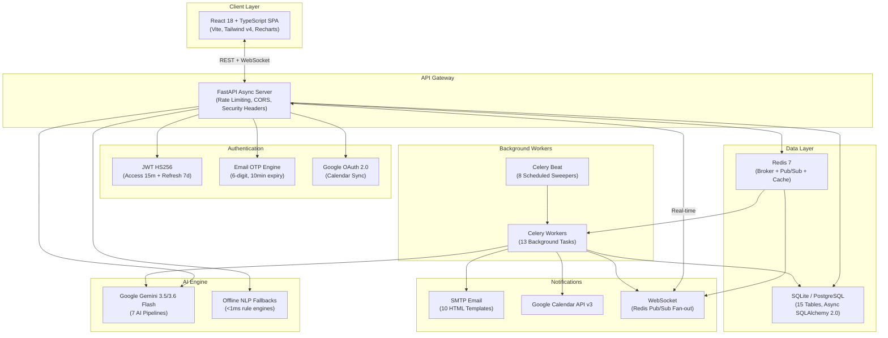

<
- [System Architecture](#-system-architecture)
- [Technology Stack](#-technology-stack)
- [Project Structure](#-project-structure)
- [Local Development Setup](#-local-development-setup)
- [Environment Configuration (.env)](#-environment-configuration-env)
- [API Endpoint Reference (73 Endpoints)](#-api-endpoint-reference-73-endpoints)
- [Database Schema (15 Models)](#-database-schema--architecture-15-models)
- [Core LLM Prompts & Structured Outputs](#-core-llm-prompts--structured-outputs)
- [Google Calendar OAuth 2.0 Setup](#-google-calendar-oauth-20-integration-setup)
- [System Design Write-up](#-system-design-write-up)
- [Tests/Integration-Tests](#-testsintegration-tests)
- [Next Major Phase](#%EF%B8%8F-next-major-phase-ai-voice-assistant-for-appointment-rescheduling)

---

## 🌟 Key Features & Standout Differentiators

### 🔒 Zero Double-Booking Concurrency Engine
- **PostgreSQL**: Pessimistic row-level locking via `SELECT ... FOR UPDATE SKIP LOCKED` prevents race conditions at the database level.
- **SQLite**: Serialized atomic validation checks within transactions.
- **5-Minute Slot Hold TTL**: Patients get a temporary lock while completing intake forms — expired holds are auto-released by a Celery Beat sweeper every 60 seconds.
- **Patient Overlap Guard**: Blocks patients from confirming overlapping appointments across different doctors.

### 🤖 Google Gemini AI Integration (7 AI Pipelines)
| Pipeline | Trigger | Output |
|---|---|---|
| **Pre-Visit Symptom Triage** | Patient submits symptoms | Urgency level (`LOW`/`MEDIUM`/`HIGH`), chief complaint, key symptoms, red flags, suggested questions |
| **Specialty Recommendation** | Before booking | Recommends 1 of 6 specialties + extracts intake parameters (duration, severity, triggers) |
| **Post-Visit Note Summarization** | Doctor submits notes | Patient-friendly summary + structured medication schedule with daily reminder times |
| **Cross-Specialty Clinical Briefing** | Doctor opens consultation | Specialty history (Category A), systemic medical context (Category B), diagnostic suggestions (Category C) |
| **Cancellation Reason Analysis** | Doctor cancels appointment | Categorizes reason as `EMERGENCY` (0x), `CONVENIENCE` (1.5x), or `UNJUSTIFIED` (2.0x) demerit multiplier |
| **Leave Approval Recommendation** | Admin reviews leave request | AI recommendation (`APPROVE`/`REJECT`/`CAUTION`) with operational reasoning |
| **Hospital Operations Insights** | Admin requests analytics | Chief Medical Officer briefing: staffing bottlenecks, peak hours, capacity utilization |

- **Model Fallback Cascade**: `gemini-3.6-flash` → `gemini-3.5-flash` → `gemini-3.5-flash-lite` with 3 exponential retries.
- **Zero-Downtime Offline Fallbacks**: Local NLP rule engines execute in <1ms when API keys are exhausted.

### ⚖️ Clinical Governance & Doctor Accountability
- **AI-Driven Demerit Points**: Doctors earn penalties for cancelling confirmed appointments — scored by patient urgency, replacement doctor availability, and Gemini-analyzed reason classification.
- **Auto-Suspension**: Accumulating ≥10 demerits triggers `is_suspended = True`, completely locking the doctor's dashboard and clinical actions.
- **Admin Reactivation**: Administrators can review, reset demerits to 0, and reactivate suspended doctors.
- **Overdue Appointment Sweep**: Celery Beat detects appointments unstarted >2 hours after slot end — auto-cancels and penalizes with 5 demerits.
- **Reassignment Protection**: Admin-reassigned slots are marked `reassigned_by_admin = True`, preventing doctors from cancelling them.

### 💊 Smart Medication Reminder System
- **AI Prescription Parsing**: Gemini extracts medication names, dosages, frequencies, and exact daily reminder times from free-text doctor notes.
- **Grouped Email Alerts**: Multiple medications due at the same minute are intelligently consolidated into a single combined email.
- **Local Timezone Awareness**: Reminder sweeper checks against server local time (not UTC) for accurate IST scheduling.

### 📄 Watermarked PDF Prescriptions
- **ReportLab Canvas**: Generates styled prescription tickets with patient info, doctor details, symptoms, clinical notes, AI care guidelines, and dosage tables.
- **Diagonal Watermark**: `"MEDPLUS AI"` rendered at 45° angle with `setFillAlpha(0.06)` transparency.
- **3-Column Verification Block**: Digital verification (OTP check), handwritten fields (Person Name / Signature / Stamp), and consulting physician signature line.

### 🔔 Real-Time Multi-Channel Notifications
- **WebSocket (Redis Pub/Sub)**: Live UI updates when AI triage completes, appointments change status, or overdue reminders fire — no polling required.
- **In-App Notification Bell**: 30-second background polling with unread badges, categorized icons, and click-through navigation.
- **HTML Email Templates**: 10 Jinja2 templates covering booking confirmations, reminders, cancellations, leave notices, medication alerts, OTP codes, and more.
- **Google Calendar OAuth 2.0**: Two-way sync of patient appointments with Google Calendar via stored OAuth tokens.

### 🏢 Admin Command Center
- **Operational Dashboard**: KPI cards, Recharts pie charts, HIPAA audit status widgets.
- **Gemini AI Analyst**: On-demand hospital operations report with staffing alerts, peak hours prediction, and capacity gauges.
- **System Telemetry**: Real-time CPU/Memory gauges, database row counts, Redis health, and live SMTP dispatch logs.
- **Doctor Performance Analytics**: Per-doctor KPI dashboard with time filters (Day/Month/3M/6M/1Y/Total), Gemini practice audit, and directive dispatch.
- **Appointment Reassignment**: Find conflict-free doctors of the same specialty and reassign slots with full notification cascades.
- **1-Click Sandbox Reset**: Purge and re-seed database for evaluator demos.

### 🛡️ Security & Compliance
- **JWT Authentication**: HS256 access tokens (15min) + refresh tokens (7 days) with automatic session invalidation.
- **Email OTP Verification**: 6-digit codes with 10-minute expiry for registration and password reset.
- **RBAC Route Guards**: Every endpoint and frontend route enforces role-based access (`PATIENT`, `DOCTOR`, `ADMIN`).
- **Rate Limiting**: SlowAPI middleware enforces 200 requests/minute per IP.
- **Security Headers**: `X-Content-Type-Options`, `X-Frame-Options`, `X-XSS-Protection` on every response.
- **HIPAA Audit Trail**: All clinical actions logged with actor, target, timestamp, and details — searchable by role/action/keyword.
- **Input Sanitization**: Phone number validation rejects dummy/sequential/repeating digits; 4-rule password strength enforcement.

---

## 🏗️ System Architecture



---

## 🛠️ Technology Stack

| Layer | Technologies |
|---|---|
| **Backend Framework** | Python 3.11+, FastAPI (Async), Pydantic v2, Uvicorn |
| **Database & ORM** | SQLite / PostgreSQL, Async SQLAlchemy 2.0, Alembic |
| **Task Queue & Broker** | Redis 7, Celery 5.3, Celery Beat (8 scheduled + 5 event-driven tasks) |
| **AI / LLM** | Google Gemini 3.5/3.6 Flash (`google-genai`), Multi-model fallback cascade, Offline NLP rule engines |
| **Auth & Security** | JWT (python-jose), bcrypt, SlowAPI rate limiting, Email OTP, RBAC |
| **Notifications** | `fastapi-mail` (SMTP/STARTTLS), Google Calendar OAuth 2.0 API v3, Redis Pub/Sub WebSockets |
| **PDF Generation** | ReportLab (watermarks, signature blocks, styled tables) |
| **Frontend SPA** | React 18, TypeScript, Vite, Tailwind CSS v4, Lucide Icons, Recharts, Sonner Toasts |
| **Real-Time** | WebSocket (`ws://`), Redis Pub/Sub, `canvas-confetti` celebrations |
| **Testing** | Pytest, Pytest-Asyncio, HTTPX (ASGI Transport), unittest.mock |

---

## 📂 Project Structure

```
MedPlus-AI/
├── server/
│   ├── app.py                    # FastAPI application entry, lifespan, middleware, routers
│   ├── auth.py                   # JWT tokens, bcrypt hashing, RBAC dependencies
│   ├── config.py                 # Pydantic BaseSettings environment configuration
│   ├── websocket.py              # WebSocket ConnectionManager + Redis Pub/Sub subscriber
│   ├── database/
│   │   ├── connection.py         # Async SQLAlchemy engine & session factory
│   │   ├── models.py             # 15 SQLAlchemy ORM models & enumerations
│   │   └── repositories.py       # Data access layer (User, Doctor, Appointment, Reminder repos)
│   ├── routes/
│   │   ├── auth_routes.py        # 14 endpoints — Register, Login, OTP, OAuth, Notifications
│   │   ├── patient_routes.py     # 13 endpoints — Doctors, Slots, Booking, Symptoms, PDF, Reviews
│   │   ├── doctor_routes.py      # 19 endpoints — Schedule, Approve, OTP verify, Notes, Analytics
│   │   └── admin_routes.py       # 25 endpoints — Dashboard, Doctors, Leaves, Reassign, Performance
│   ├── services/
│   │   ├── llm_service.py        # 7 Gemini AI pipelines + offline NLP fallbacks
│   │   ├── slot_service.py       # Concurrency-safe booking engine, demerit calculator, auto-reschedule
│   │   ├── email_service.py      # HTML template renderer, SMTP dispatch, simulation mode
│   │   ├── calendar_service.py   # Google Calendar OAuth 2.0 event CRUD
│   │   ├── notification_service.py  # Multi-channel notification orchestrator
│   │   └── otp_service.py        # 6-digit OTP generation, verification, expiry management
│   ├── templates/email/           # 10 Jinja2 HTML email templates
│   └── scripts/
│       └── seed_db.py            # Database seeding (admin, 6 doctors, demo patients)
├── microservices/
│   ├── celery_app.py             # Celery application & Beat schedule configuration
│   └── tasks.py                  # 13 background tasks (AI, email, calendar, sweepers)
├── frontend/
│   ├── src/
│   │   ├── App.tsx               # 22 routes with role-based guards
│   │   ├── context/AuthContext.tsx   # JWT session state, login/register/logout
│   │   ├── hooks/useWebSocket.ts     # Real-time appointment event subscriptions
│   │   ├── lib/
│   │   │   ├── api.ts            # Axios-like fetch client with 25s timeout & session invalidation
│   │   │   ├── utils.ts          # Date parsing, phone/email validation, UTC helpers
│   │   │   └── exportCsv.ts      # CSV export utility
│   │   ├── components/           # 12 shared components (Layout, NotificationBell, SlotPicker, etc.)
│   │   ├── pages/
│   │   │   ├── Landing.tsx       # SaaS marketing page with role launcher cards
│   │   │   ├── Login.tsx         # Dual-tab login with demo accelerators & forgot password
│   │   │   ├── Register.tsx      # Registration with OTP modal & password strength checker
│   │   │   ├── patient/          # 6 pages — Dashboard, DoctorSearch, BookAppointment, Appointments, Detail, Settings
│   │   │   ├── doctor/           # 3 pages — Dashboard, Analytics, Settings
│   │   │   └── admin/            # 8 pages — Dashboard, DoctorManagement, DoctorDetail, Performance, LeaveManager, AuditLog, Appointments, Patients
│   │   └── types/index.ts        # TypeScript interfaces & enums
│   └── package.json
├── tests/
│   ├── conftest.py               # Auto-teardown, schema rebuild, session fixtures
│   ├── unit/                     # 4 files — auth, email/calendar, LLM, repositories
│   ├── integration/              # 5 files — auth routes, admin, doctor, double-booking, slots
│   └── e2e/                      # 1 file — full multi-role patient-doctor-admin journey
├── requirements.txt
├── pytest.ini
└── .env.example
```

---

## 💻 Local Development Setup

### Prerequisites
- Python 3.11+
- Node.js 18+
- Redis Server (listening on `localhost:6379`)

### 1. Backend Setup
```bash
# Create virtual environment and install dependencies
python3 -m venv venv
source venv/bin/activate
pip install -r requirements.txt

# Setup environment configuration
cp .env.example .env
# Edit .env with your Gemini API key, SMTP credentials, etc.

# Start the FastAPI server (auto-seeds database on first boot)
uvicorn server.app:app --reload --port 8001
```

### 2. Celery Worker & Beat Scheduler
Run in separate terminal windows (with `venv` activated):
```bash
# Start Celery Worker (processes AI tasks, emails, calendar sync)
celery -A microservices.celery_app worker --loglevel=info

# Start Celery Beat Scheduler (runs 8 periodic sweepers)
celery -A microservices.celery_app beat --loglevel=info
```

### 3. Frontend Setup
```bash
cd frontend
npm install
npm run dev
# Open http://localhost:5173
```

### Quick Demo Access
The database auto-seeds with demo accounts on first boot:

| Role | Email | Password |
|---|---|---|
| Admin | `admin@healthcare.com` | `Admin@123` |
| Doctor | `dr.smith@healthcare.com` | `Doctor@123` |
| Patient | `patient@healthcare.com` | `Patient@123` |

---

## 📄 Environment Configuration (`.env`)

```ini
# ─── Database ───
DATABASE_URL=sqlite+aiosqlite:///./healthcare.db
SQLITE_FALLBACK=1

# ─── JWT Authentication ───
JWT_SECRET=super-secret-jwt-key-change-in-production-min-32-chars
JWT_REFRESH_SECRET=super-secret-refresh-key-change-in-production-min-32-chars
ACCESS_TOKEN_EXPIRE_MINUTES=15
REFRESH_TOKEN_EXPIRE_DAYS=7

# ─── Google Gemini AI ───
GOOGLE_GENAI_API_KEY=AIzaSy...your-actual-api-key

# ─── Email Server (SMTP) ───
SMTP_HOST=smtp.gmail.com
SMTP_PORT=587
SMTP_USER=your-email@gmail.com
SMTP_PASSWORD=your-gmail-app-password
EMAIL_FROM_NAME=MedPulse AI Smart Clinic
EMAIL_FROM_ADDRESS=noreply@medpulseai.com

# ─── Google Calendar OAuth 2.0 ───
GOOGLE_CLIENT_ID=your-client-id.apps.googleusercontent.com
GOOGLE_CLIENT_SECRET=your-client-secret
GOOGLE_REDIRECT_URI=http://localhost:8001/api/auth/google/callback

# ─── Redis & Celery ───
REDIS_URL=redis://localhost:6379/0

# ─── Application ───
BACKEND_PORT=8001
FRONTEND_URL=http://localhost:5173
ENVIRONMENT=development
```

---

## 📡 API Endpoint Reference (73 Endpoints)

### Authentication (`/api/auth`) — 14 Endpoints

| Method | Path | Auth | Description |
|---|---|---|---|
| `POST` | `/auth/send-otp` | Public | Send 6-digit verification OTP to email |
| `POST` | `/auth/verify-otp` | Public | Validate OTP code |
| `POST` | `/auth/forgot-password/request` | Public | Send password reset OTP |
| `POST` | `/auth/forgot-password/reset` | Public | Reset password with verified OTP |
| `POST` | `/auth/register` | Public | Register patient with optional OTP verification |
| `POST` | `/auth/login` | Public | Authenticate → JWT access (15m) + refresh (7d) tokens |
| `POST` | `/auth/refresh` | Public | Exchange refresh token for new token pair |
| `GET` | `/auth/me` | Any | Current user profile + Google Calendar status |
| `PUT` | `/auth/profile` | Any | Update name, phone, country |
| `GET` | `/auth/google/connect` | Any | Generate Google OAuth 2.0 consent URL |
| `GET` | `/auth/google/callback` | OAuth | Exchange Google auth code for Calendar tokens |
| `GET` | `/auth/notifications` | Any | Fetch all in-app notifications |
| `PUT` | `/auth/notifications/{id}/read` | Any | Mark notification as read |
| `PUT` | `/auth/notifications/read-all` | Any | Mark all notifications as read |

### Patient Portal (`/api/patient`) — 13 Endpoints

| Method | Path | Auth | Description |
|---|---|---|---|
| `POST` | `/patient/analyze-specialty` | Public | AI symptom analysis → specialty recommendation + intake extraction |
| `GET` | `/patient/doctors` | Public | List active doctors (filter by specialty/name, includes ratings) |
| `GET` | `/patient/doctors/{id}` | Public | Doctor profile with review stats |
| `GET` | `/patient/doctors/{id}/slots` | Public | Generate available time slots for a date |
| `POST` | `/patient/appointments` | Patient | Hold slot for 5 minutes (pessimistic lock) |
| `POST` | `/patient/appointments/{id}/symptoms` | Patient | Submit symptoms → AI triage + specialty validation |
| `POST` | `/patient/appointments/{id}/confirm` | Patient | Confirm booking → OTP generation + email + calendar sync |
| `PUT` | `/patient/appointments/{id}/reschedule` | Patient | Atomic reschedule: cancel old + reserve new + copy symptoms |
| `DELETE` | `/patient/appointments/{id}` | Patient | Cancel appointment + email + calendar cleanup |
| `GET` | `/patient/appointments` | Patient | List appointments (filter, search, paginate) |
| `GET` | `/patient/appointments/{id}` | Patient | Full detail with AI summaries + post-visit notes |
| `POST` | `/patient/appointments/{id}/review` | Patient | Submit 1-5 star rating + comment |
| `GET` | `/patient/appointments/{id}/pdf` | Patient/Admin | Download watermarked prescription PDF |

### Doctor Portal (`/api/doctor`) — 19 Endpoints

| Method | Path | Auth | Description |
|---|---|---|---|
| `GET` | `/doctor/appointments` | Doctor | Schedule with status/date filters |
| `GET` | `/doctor/appointments/{id}` | Doctor | Appointment detail with AI triage |
| `POST` | `/doctor/appointments/{id}/notes` | Doctor | Submit clinical notes + prescription → AI summary task |
| `PUT` | `/doctor/appointments/{id}/complete` | Doctor | Complete consultation + email next-patient briefing |
| `PUT` | `/doctor/appointments/{id}/approve` | Doctor | Approve pending booking → CONFIRMED + notifications |
| `PUT` | `/doctor/appointments/{id}/reject` | Doctor | Reject pending booking request |
| `POST` | `/doctor/appointments/{id}/start-verify` | Doctor | Verify patient's 4-digit OTP → start consultation |
| `POST` | `/doctor/appointments/{id}/cancel` | Doctor | Cancel with Gemini reason analysis → demerit calculation → auto-reschedule |
| `GET` | `/doctor/appointments/{id}/patient-history` | Doctor | Longitudinal cross-doctor medical history |
| `GET` | `/doctor/appointments/{id}/patient-history-ai-summary` | Doctor | Gemini clinical briefing (3 categories) |
| `GET` | `/doctor/settings` | Doctor | Working hours, intake questions, reviews |
| `PUT` | `/doctor/settings` | Doctor | Update clinical settings |
| `POST` | `/doctor/working-hours-request` | Doctor | Submit schedule change request for admin approval |
| `GET` | `/doctor/working-hours-request/status` | Doctor | Check request status |
| `POST` | `/doctor/leave-request` | Doctor | Submit leave request |
| `GET` | `/doctor/leave-requests` | Doctor | List leave requests with admin feedback |
| `GET` | `/doctor/notes` | Doctor | Admin directive notes inbox |
| `PUT` | `/doctor/notes/{id}/read` | Doctor | Mark directive as read |
| `GET` | `/doctor/analytics` | Doctor | Practice metrics, trends, urgency distribution, heatmap |

### Admin Operations (`/api/admin`) — 25 Endpoints

| Method | Path | Auth | Description |
|---|---|---|---|
| `GET` | `/admin/dashboard` | Admin | Global KPI stats |
| `POST` | `/admin/doctors` | Admin | Create doctor account + profile |
| `GET` | `/admin/doctors` | Admin | List all doctors (active/inactive) |
| `GET` | `/admin/doctors/{id}` | Admin | Doctor profile detail |
| `PUT` | `/admin/doctors/{id}` | Admin | Override profile, hours, slot duration |
| `DELETE` | `/admin/doctors/{id}` | Admin | Soft-delete (deactivate) doctor |
| `POST` | `/admin/doctors/{id}/leave` | Admin | Direct leave marking → auto-reschedule affected appointments |
| `GET` | `/admin/doctors/{id}/leave` | Admin | Doctor leave history |
| `DELETE` | `/admin/doctors/{id}/leave/{leave_id}` | Admin | Remove leave entry |
| `POST` | `/admin/doctors/{id}/notes` | Admin | Send priority directive (URGENT/IMPORTANT/ROUTINE) + email |
| `GET` | `/admin/doctors/{id}/notes` | Admin | List directives sent to doctor |
| `GET` | `/admin/doctors/{id}/performance` | Admin | Performance analytics with Gemini audit (filterable by period) |
| `POST` | `/admin/doctors/{id}/reactivate` | Admin | Reset demerits to 0, unsuspend doctor |
| `GET` | `/admin/working-hours-requests` | Admin | Pending schedule change requests |
| `PUT` | `/admin/working-hours-requests/{id}/resolve` | Admin | Approve/reject schedule change |
| `GET` | `/admin/leave-requests` | Admin | Leave requests + Gemini AI recommendation |
| `PUT` | `/admin/leave-requests/{id}/resolve` | Admin | Approve/reject leave → auto-reschedule |
| `GET` | `/admin/audit-logs` | Admin | HIPAA audit trail (searchable by role/action/keyword) |
| `POST` | `/admin/ai-insights` | Admin | Gemini hospital operations analysis |
| `GET` | `/admin/telemetry` | Admin | System health (CPU, Memory, Redis, DB metrics) |
| `GET` | `/admin/smtp-logs` | Admin | Email dispatch simulation logs |
| `GET` | `/admin/patients` | Admin | Patient registry with appointment stats |
| `GET` | `/admin/appointments` | Admin | All-clinic appointment command center |
| `GET` | `/admin/appointments/{id}/available-doctors` | Admin | Conflict-free replacement doctors for reassignment |
| `POST` | `/admin/appointments/{id}/reassign` | Admin | Reassign to another doctor + 3 emails + 3 notifications |

### System (`/api` & WebSocket) — 2 Endpoints

| Method | Path | Description |
|---|---|---|
| `GET` | `/api/health` | Service health check |
| `WS` | `/ws/appointments/{id}` | Real-time WebSocket (AI summaries, status changes) |

---

## 🗄️ Database Schema & Architecture (15 Models)

### Core Tables

#### 1. `users`
| Column | Type | Constraints | Description |
|---|---|---|---|
| `id` | String(36) | PK | UUID4 |
| `email` | String(255) | Unique, Index | Contact email |
| `password_hash` | String(255) | Not Null | bcrypt (12 rounds) |
| `full_name` | String(255) | Not Null | Display name |
| `phone` | String(50) | Nullable | International phone |
| `country` | String(100) | Default="India" | Country of residence |
| `role` | Enum | Not Null | `PATIENT`, `DOCTOR`, `ADMIN` |
| `google_access_token` | Text | Nullable | Google Calendar OAuth token |
| `google_refresh_token` | Text | Nullable | Google Calendar refresh token |

#### 2. `doctor_profiles`
| Column | Type | Constraints | Description |
|---|---|---|---|
| `id` | String(36) | PK | UUID4 |
| `user_id` | String(36) | FK → `users.id`, Unique | 1:1 user link |
| `specialisation` | String(100) | Index | Clinical specialty |
| `working_hours` | JSON | Not Null | `{"mon": {"start": "09:00", "end": "17:00"}, ...}` |
| `slot_duration_minutes` | Integer | Default=30 | Consultation window |
| `intake_questions` | JSON | Nullable | Custom intake questionnaire |
| `demerit_points` | Integer | Default=0 | Penalty accumulator |
| `is_suspended` | Boolean | Default=False | Locks dashboard at ≥10 |
| `is_active` | Boolean | Default=True | Active practice status |

#### 3. `appointments`
| Column | Type | Constraints | Description |
|---|---|---|---|
| `id` | String(36) | PK | UUID4 |
| `patient_id` | String(36) | FK → `users.id`, Index | Patient |
| `doctor_id` | String(36) | FK → `doctor_profiles.id`, Index | Doctor |
| `slot_start` / `slot_end` | DateTime | Index | Consultation window |
| `status` | Enum | Index | `HELD`, `CONFIRMED`, `CANCELLED`, `COMPLETED`, `RESCHEDULED`, `PENDING_APPROVAL` |
| `hold_expires_at` | DateTime | Index | 5-minute hold TTL |
| `start_otp` | String(4) | Nullable | 4-digit consultation start code |
| `is_started` | Boolean | Default=False | Consultation in progress |
| `reassigned_by_admin` | Boolean | Default=False | Prevents doctor cancellation |
| **Composite Index** | | `idx_doc_slot_status` | `(doctor_id, slot_start, status)` |

#### 4. `symptom_forms`
| Column | Type | Description |
|---|---|---|
| `symptoms_text` | Text | Free-text patient intake |
| `pre_visit_summary` | JSON | AI triage: urgency, complaint, symptoms, red flags, intake answers |
| `urgency_level` | Enum | `LOW`, `MEDIUM`, `HIGH` |
| `llm_status` | Enum | `PENDING`, `PROCESSING`, `SUCCESS`, `FAILED` |

#### 5. `post_visit_notes`
| Column | Type | Description |
|---|---|---|
| `doctor_notes` | Text | Clinical notes |
| `prescription_text` | Text | Prescription plan |
| `patient_summary` | Text | AI patient-friendly summary |

#### Additional Tables
| # | Table | Purpose |
|---|---|---|
| 6 | `doctor_leaves` | Direct admin-marked leave dates |
| 7 | `doctor_leave_requests` | Doctor-submitted leave requests (PENDING/APPROVED/REJECTED) |
| 8 | `working_hours_requests` | Schedule change proposals for admin approval |
| 9 | `medication_reminders` | AI-extracted daily medication schedules with reminder times |
| 10 | `calendar_events` | Google Calendar event IDs (patient + doctor calendars) |
| 11 | `doctor_reviews` | Patient 1-5 star ratings and comments |
| 12 | `audit_logs` | HIPAA security audit trail |
| 13 | `email_otps` | 6-digit OTP codes with 10-minute expiry |
| 14 | `admin_notes` | Priority directives (URGENT/IMPORTANT/ROUTINE) |
| 15 | `in_app_notifications` | Notification bell feed entries |

---

## 🤖 Core LLM Prompts & Structured Outputs

### 1. Pre-Visit Symptoms Triage
```text
System: You are an expert clinical triage assistant. Analyze the patient's intake
symptoms and generate a structured clinical assessment.

Output Schema:
{
  "urgency_level": "LOW" | "MEDIUM" | "HIGH",
  "chief_complaint": "string",
  "key_symptoms": ["string"],
  "suggested_questions": ["string"],
  "red_flags": ["string"],
  "intake_answers": { "question": "AI-extracted answer" }
}
```

### 2. Post-Visit Note Summarization & Medication Extraction
```text
System: You are a clinical pharmacist and scribe. Convert doctor notes into:
1. A patient-friendly summary (diagnosis, what to do, what to avoid).
2. Structured medication schedules with daily reminder times.

Output Schema:
{
  "patient_summary": "string",
  "medications": [{
    "name": "string", "dosage": "string",
    "frequency": "string", "reminder_times": ["HH:MM"],
    "duration_days": number
  }]
}
```

### 3. Cross-Specialty Clinical Briefing
```text
System: You are a senior clinical diagnostician. Analyze this patient's medical
history across all clinic visits and provide:
- Category A: Specialty-specific longitudinal history
- Category B: Cross-specialty systemic medical context
- Category C: Diagnostic risk factors and follow-up suggestions
```

### 4. Cancellation Reason Analysis
```text
System: Categorize this doctor's cancellation reason as:
- EMERGENCY (genuine medical/personal emergency) → 0x multiplier
- CONVENIENCE (schedule preference, non-urgent) → 1.5x multiplier
- UNJUSTIFIED (no valid reason) → 2.0x multiplier
```

### 5. Leave Approval Recommendation
```text
System: You are a hospital operations advisor. Given workload metrics (confirmed
appointments, high-urgency cases, monthly leaves taken), recommend APPROVE, REJECT,
or CAUTION with operational reasoning.
```

---

## 📅 Google Calendar OAuth 2.0 Integration Setup

1. **Google Cloud Console**: Create project → Enable **Google Calendar API**
2. **OAuth Consent Screen**: Add scopes `.../auth/calendar` and `.../auth/calendar.events`, add test user emails
3. **Create Credentials**: OAuth Client ID (Web Application) → Set redirect URI: `http://localhost:8001/api/auth/google/callback`
4. **Environment**: Copy `Client ID` and `Client Secret` to `.env`
5. **Usage**: Patients click "Sync with Google Calendar" in Settings → OAuth flow → tokens stored → Celery tasks auto-sync events

---

## 📐 System Design Write-up

### 1. Concurrency & Double-Booking Prevention
MedPulse AI prevents duplicate bookings using a dialect-aware locking strategy. On PostgreSQL, the slot service issues `SELECT ... FOR UPDATE SKIP LOCKED`, acquiring an exclusive row-level lock that causes concurrent transactions targeting the identical slot to skip the locked row entirely — guaranteeing exactly one successful reservation. On SQLite (development mode), serialized transaction isolation achieves equivalent safety through atomic check-then-insert patterns. The system validates both doctor-side conflicts (same doctor, same slot) and patient-side overlaps (same patient, overlapping time windows across different doctors), rejecting the second booking with a `SlotConflictError`.

### 2. Temporary Slot Hold Mechanism
To balance user experience with slot fairness, we implement a 5-minute hold TTL. When a patient selects a slot, the system creates an `Appointment` record with `status = 'HELD'` and `hold_expires_at = now + 5 minutes`. This hold is immediately visible to other users — the slot shows as unavailable. The frontend renders a live countdown bar with progressive color transitions (teal → amber → red with pulse animation). A Celery Beat task (`release_expired_holds_task`) sweeps every 60 seconds to delete expired holds. Additionally, the slot query engine performs lazy filtering, excluding holds where `hold_expires_at < now` from availability results. The frontend also performs cleanup on component unmount and browser navigation, calling `DELETE` to release the hold early.

### 3. Doctor Leave Conflict Resolution & Auto-Rescheduling
When an admin approves a doctor's leave request or directly marks a leave date, the system dispatches `handle_doctor_leave_task` to Celery. This task queries all `CONFIRMED`, `HELD`, and `PENDING_APPROVAL` appointments on the affected date. For each appointment, it searches for alternative doctors matching the same specialty who are: (a) active and not suspended, (b) working on that day per their `working_hours` JSON, (c) not on leave themselves, and (d) have no conflicting bookings at the original time. Candidates are sorted by slot proximity to the original time. If a match is found, the appointment is atomically reassigned with `reassigned_by_admin = True` (preventing the new doctor from cancelling it), a new OTP is generated, and both doctors plus the patient receive email notifications and in-app alerts. If no replacement is available, the appointment is cancelled with full notifications.

### 4. Demerit Calculation & Auto-Suspension Engine
When a doctor cancels a confirmed appointment, the governance engine computes penalties using a multi-factor formula: `Base Points (HIGH=5, MEDIUM=3, LOW=1) + Availability Penalty (3 if no replacement doctor exists)`, multiplied by a Gemini-analyzed reason classifier: `EMERGENCY = 0.0x` (no penalty), `CONVENIENCE = 1.5x`, `UNJUSTIFIED = 2.0x`. Points accumulate on `doctor_profiles.demerit_points`. Reaching ≥10 triggers automatic suspension: `is_suspended = True`, dashboard lockout overlay, suspension email, and audit log entry. The `missed_appointment_check_task` sweeper adds 5 demerits for appointments unstarted >2 hours past their slot end. Administrators can review and reset demerits via the reactivation endpoint.

### 5. Resilient Notification & Sync Retry Architecture
All external integrations (SMTP, Google Calendar, Gemini AI) are wrapped in Celery tasks with exponential backoff retry policies: $T_{\text{wait}} = 2^{\text{retry}} + \text{jitter}$, with a maximum of 3-5 retries per task. A `retry_failed_emails_task` sweeper runs every 5 minutes to detect confirmed appointments missing `CalendarEvent` records — indicating a broken sync chain — and re-queues them. Similarly, `retry_failed_llm_task` re-processes symptom forms and post-visit notes stuck in `FAILED` status with `retry_count < 5`. The AI pipeline itself cascades through three Gemini model tiers before falling back to deterministic NLP rule engines that execute in under 1 millisecond, ensuring zero-downtime clinical operations regardless of external API availability.

### 6. Real-Time Event Architecture
The system uses Redis Pub/Sub as a message bus between Celery workers and browser clients. When a background task completes (e.g., AI triage finishes), it publishes a JSON event to a Redis channel keyed by appointment ID. A background `asyncio` subscriber running inside the FastAPI process listens to these channels and fans out events to all connected WebSocket clients for that appointment. This architecture enables instant UI updates — the patient sees their AI triage results appear in real-time without page refresh, and doctors see appointment status changes reflected immediately in their dashboard.

---

## 🧪 Tests/Integration-Tests

### Test Suite Overview — **40 Tests, 100% Pass Rate**

```
tests/
├── conftest.py                          # Auto-teardown, schema rebuild per test
├── unit/
│   ├── test_auth.py                     # 3 tests — bcrypt hashing, JWT access/refresh tokens
│   ├── test_email_calendar_services.py  # 5 tests — template rendering, SMTP sim, calendar CRUD, notification orchestrator
│   ├── test_llm_service.py              # 11 tests — JSON extraction, triage fallbacks, Gemini success/failure, urgency normalization
│   └── test_repositories.py            # 4 tests — User/Doctor/Appointment/Reminder repository CRUD
├── integration/
│   ├── test_auth_routes.py              # 1 test — full auth lifecycle (health → register → login → refresh → profile)
│   ├── test_admin_routes.py             # 3 tests — doctor CRUD/RBAC, working hours approval flow, control center endpoints
│   ├── test_doctor_routes.py            # 1 test — multi-appointment AI clinical briefing (cross-specialty Categories A/B/C)
│   ├── test_double_booking.py           # 2 tests — concurrent race condition prevention, patient overlap blocking
│   └── test_slot_booking.py             # 9 tests — slot math, hold conflicts, leave blocking, TTL expiry, full HTTP lifecycle
└── e2e/
    └── test_complete_flow.py            # 1 test — 13-step multi-role journey (admin → patient → doctor → completion)
```

### Key Test Highlights

| Test | What It Validates |
|---|---|
| `test_concurrent_double_booking_prevention` | Two `asyncio.gather` tasks race for the same slot — exactly one succeeds, one gets `SlotConflictError` |
| `test_doctor_patient_history_ai_summary` | Books 3 appointments across 2 specialists, completes 2, verifies Gemini generates correct cross-specialty briefing |
| `test_full_booking_lifecycle_http` | Complete HTTP lifecycle: admin onboard → patient search → hold → symptoms → confirm → doctor approve → notes → complete |
| `test_full_patient_doctor_e2e_journey` | 13-step multi-role simulation covering registration through consultation completion |
| `test_pre_visit_summary_api_exception_returns_fallback` | Simulates Gemini quota exhaustion and verifies graceful fallback |

### Running Tests
```bash
# Activate virtual environment
source venv/bin/activate

# Run full suite with verbose output
PYTHONPATH=. pytest tests/ -v

# Expected output:
# ================= 40 passed, 275 warnings in 83.53s ==================
```

### Test Infrastructure
- **Isolated Database**: Tests use `sqlite+aiosqlite:///./test_healthcare.db` — never touches development data.
- **Auto-Teardown**: Every test drops and rebuilds all 15 tables, then deletes all rows in foreign-key-safe order.
- **ASGI Transport**: HTTP tests use `httpx.AsyncClient(transport=ASGITransport(app=app))` for in-memory request execution.
- **Celery Mocking**: Background tasks are patched with `unittest.mock.patch` to allow full HTTP testing without Redis/Celery.
- **Async-First**: `asyncio_mode = auto` in `pytest.ini` — all async tests run natively without explicit markers.

---

## ⏭️ Next Major Phase: AI Voice Assistant for Appointment Rescheduling

Our next engineering phase integrates an **AI-Driven Voice Assistant** using Twilio, VAPI, and Gemini for automated phone-based appointment rescheduling:


### Key Technical Aspects
1. **Gemini Realtime API**: WebSocket interface providing low-latency voice feedback (<1.5 seconds) for natural conversations.
2. **Dynamic Slot Querying Tool**: Exposes `/api/patient/doctors/{id}/slots` as a function call within the voice agent's context.
3. **Conflict Mitigation**: Reserves slots temporarily while the call is active to prevent concurrent booking conflicts.

---

<p align="center">
  <strong>Built with ❤️ using FastAPI, React, Google Gemini, and a commitment to zero-downtime clinical operations.</strong>
</p>
]]>
