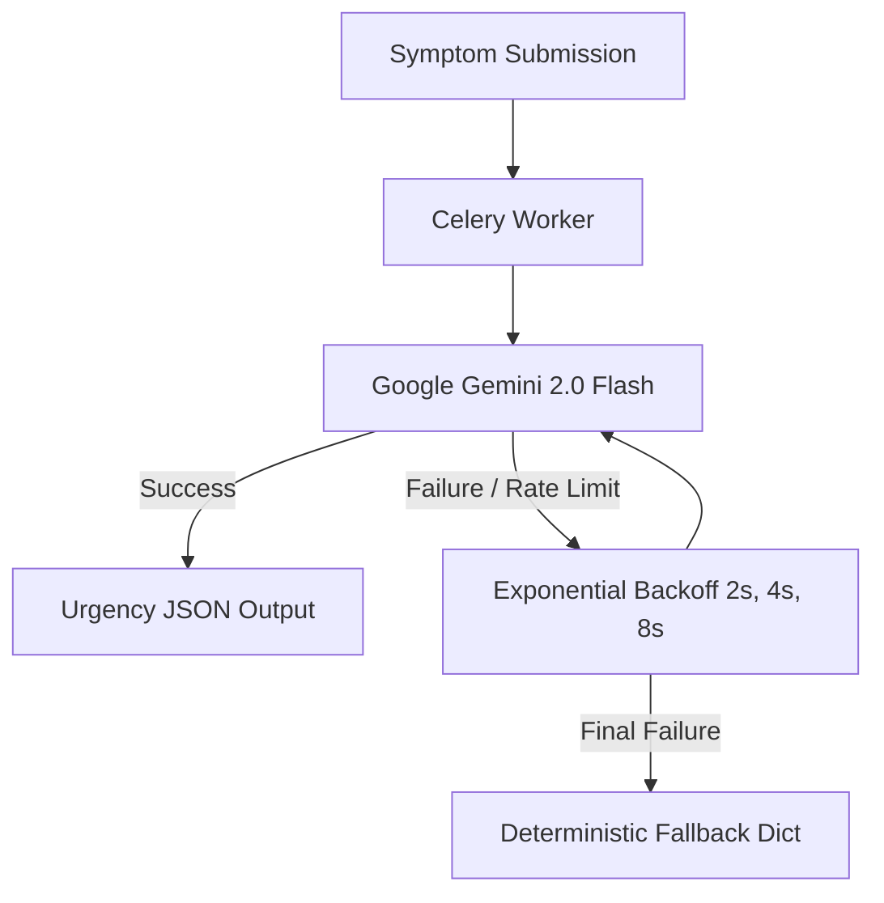

# System Architecture & Technical Design Document

**Project:** HealthCare Appointment & Follow-Up Manager  
**Version:** 1.0.0  
**Compliance Target:** HIPAA & Medical Data Privacy Standards  

---

## 1. Executive Summary & Overview

The HealthCare Appointment & Follow-Up Manager is a modern, full-stack medical consultation and scheduling engine. It bridges real-time availability management with Google Gemini 2.0 AI symptom triage, clinical governance systems, and automated post-visit follow-up notes.

---

## 2. 3-Layer Concurrency & Slot Locking Engine

To guarantee zero double-booking across concurrent patient requests, the platform implements a 3-tier concurrency architecture:

```mermaid
flowchart TD
    A[Patient Client] --> B[FastAPI Service]
    B --> C{SELECT FOR UPDATE SKIP LOCKED (PostgreSQL 16)}
    C -->|Fallback| D[SQLite Atomic Concurrency Fallback]
    C --> E[5-Min TTL Hold]
    D --> E
    E <--> F[Redis Key Expiry & Celery Beat]
```

1. **PostgreSQL Pessimistic Row Locking (`SELECT FOR UPDATE SKIP LOCKED`):**
   When a patient initiates a hold, PostgreSQL locks the exact slot row. Concurrent requests immediately skip locked rows without thread blocking or deadlock.
2. **SQLite Atomic Concurrency Fallback:**
   For local development/testing without PostgreSQL, isolated atomic transaction checks verify slot status before setting `HELD`.
3. **5-Minute Temporary Slot Hold TTL:**
   Slots are placed in a transient `HELD` status with `hold_expires_at = NOW() + 5 minutes`. If the patient fails to submit symptoms or confirm within 300 seconds, Celery Beat automatically releases the slot back to `AVAILABLE`.

---

## 3. Clinical Governance: Demerits, Suspension, and Reactivation

The platform employs a robust clinical governance engine to ensure professional reliability.

- **Doctor Demerits Engine:** When an appointment is canceled by a doctor without valid justification, demerit points are automatically assigned. An AI-based Cancellation Reason Classification model assists in determining if a reason is valid or if it warrants demerits.
- **Auto-Suspension:** Once a doctor crosses a configured threshold of demerits, their profile is automatically suspended, preventing any new bookings.
- **Reactivation Engine:** The CMO/Admin can review the doctor's record, analyze their performance, and manually reactivate the profile, resetting or reducing demerits.

---

## 4. Doctor Leave Cascade & Automated Reschedule Resolver

When an admin marks a doctor as on leave for a specific date:

1. A `DoctorLeave` record is created.
2. A single atomic database transaction identifies all `CONFIRMED` or `HELD` appointments for that doctor on that date.
3. Appointments are transitioned to `CANCELLED`.
4. **Automated Reschedule Conflict Resolver:** Affected patients are automatically notified and provided with links to reschedule their appointments to the nearest available slots for that specific doctor or an alternative doctor in the same specialty.
5. Celery dispatches `handle_doctor_leave_task` asynchronously to email affected patients and revoke synced Google Calendar events.

---

## 5. LLM Integration & Resiliency Pipeline



- **Pre-Visit Triage:** Formats patient symptoms into urgency categories (`LOW`, `MEDIUM`, `HIGH`), chief complaint, and 3 suggested clinical questions for the physician.
- **Post-Visit Explanation:** Transforms physician clinical notes & prescriptions into patient-friendly language and extracts structured medication schedules (`MedicationReminder`).
- **Resilient Notifications & AI:** 3-attempt exponential backoff retry loop for both AI processing and resilient notification retries (e.g., Email/SMS/Webhook) with non-blocking deterministic fallback dicts.

---

## 6. Background Task Architecture (Celery & Redis Pub/Sub)

- **Celery Beat Schedules:**
  - `release_expired_holds_task` (Every 60s)
  - `send_appointment_reminders_task` (Every 15m)
  - `send_medication_reminders_task` (Every 30m)
  - `retry_failed_llm_task` (Every 15m)
  - `retry_failed_emails_task` (Every 5m) - Resilient notification retries with exponential backoffs.
- **WebSocket Live Updates:**
  Updates are published to Redis channels (`appointment:<id>`). FastAPI lifespan runs an async Redis subscriber that broadcasts JSON payloads to connected browser clients in real time.
