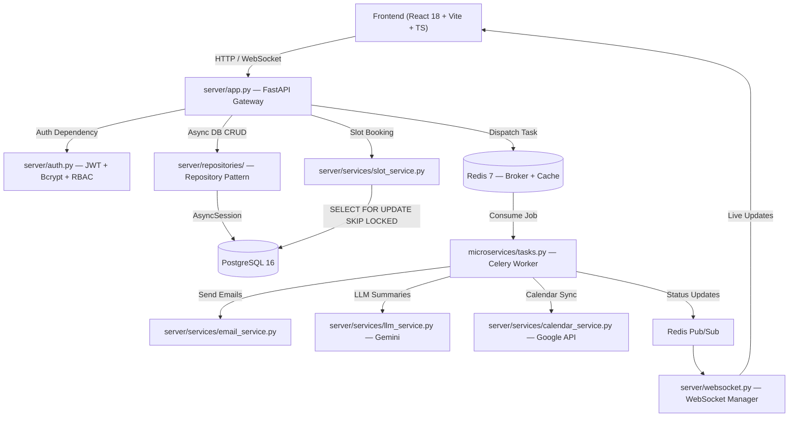

# Healthcare Appointment & Follow-up Manager — Project Plan

> Modeled after the [Metis](file:///mnt/shared/Projects/Metis) production architecture — FastAPI + Celery + React + PostgreSQL.

A full-stack healthcare appointment platform with separate portals for **Patients**, **Doctors**, and **Admin**. The system handles appointment booking with concurrency-safe slot management, LLM-powered symptom summaries, post-visit notes, email notifications, Google Calendar integration, and medication reminders.

---

## Table of Contents

- [Architecture Overview](#architecture-overview)
- [Technology Stack](#technology-stack)
- [Phase 1 — Foundation & Scaffolding](#phase-1--foundation--scaffolding)
- [Phase 2 — Core Backend Services](#phase-2--core-backend-services)
- [Phase 3 — Celery Workers & Background Jobs](#phase-3--celery-workers--background-jobs)
- [Phase 4 — LLM Integration](#phase-4--llm-integration)
- [Phase 5 — Email & Google Calendar Integration](#phase-5--email--google-calendar-integration)
- [Phase 6 — Frontend: Auth & Patient Portal](#phase-6--frontend-auth--patient-portal)
- [Phase 7 — Frontend: Doctor & Admin Portals](#phase-7--frontend-doctor--admin-portals)
- [Phase 8 — Testing & Quality Assurance](#phase-8--testing--quality-assurance)
- [Phase 9 — Documentation & Deployment](#phase-9--documentation--deployment)
- [Open Questions](#open-questions)

---

## Architecture Overview



---

## Technology Stack

| Layer | Technology | Purpose |
|:------|:-----------|:--------|
| **Backend Framework** | FastAPI + Uvicorn | Async ASGI REST API + WebSocket server |
| **Database + ORM** | PostgreSQL 16 + SQLAlchemy 2.0 (async) | Async ORM, Repository Pattern, migrations via Alembic |
| **Task Queue + Broker** | Celery + Redis | Background jobs: email, reminders, LLM retries, hold expiry |
| **Caching** | Redis 7 | Slot hold tracking, session cache |
| **Authentication** | JWT (python-jose) + Bcrypt | Access tokens (15m) + Refresh tokens (7d), role-based auth |
| **LLM Integration** | Google Gemini (google-genai SDK) | Pre-visit & post-visit summary generation |
| **Email** | fastapi-mail (aiosmtplib) | Booking confirmations, reminders, cancellations |
| **Calendar** | Google Calendar API (googleapis) | OAuth 2.0 event create/update/delete |
| **Frontend** | React 18 + Vite + TypeScript | SPA with role-based portals |
| **UI Components** | Tailwind CSS + shadcn/ui (Radix) | Modern, accessible component library |
| **Deployment** | Docker Compose + Nginx | 5-service orchestration |

---

## Standout Strategy — How We Beat 499 Candidates

### What Most Candidates Will Submit
- Basic Bootstrap/Material UI forms with plain CRUD
- No animations, no dark mode, no loading states
- Simple LLM call with no error handling (app crashes if API is down)
- Plain text emails (if they even implement email)
- Skip Google Calendar or half-implement it
- No Docker — "run npm start" in README
- No tests, no system design, weak documentation
- No real-time updates, no onboarding, no data export

### What We'll Deliver — Organized by Impact

#### 🎨 A. UI/UX — Picture Perfect (The First Impression)

| # | Feature | Why It Stands Out |
|---|---------|-------------------|
| A1 | **Animated Landing Page** | Glassmorphism header, gradient headlines, social proof badges, compliance pills, animated CTA — like a SaaS product, not an intern project |
| A2 | **Dark / Light Mode** | HSL CSS variable system with smooth transition — shows design systems thinking |
| A3 | **Interactive Onboarding Tour** | React Joyride — 4-step guided tour per role on first login, "Watch Demo" on landing page |
| A4 | **Skeleton Loaders** | Shimmer placeholders instead of spinners — feels premium and responsive |
| A5 | **Micro-Animations** | Hover effects, button press feedback, card entrance animations, smooth tab transitions via `tailwindcss-animate` |
| A6 | **Real-Time Slot Hold Countdown** | Visible 5:00 → 0:00 timer during booking with urgency color shift (green → amber → red) |
| A7 | **Urgency Color-Coded AI Cards** | Pre-visit summary cards with pulsing badge: 🟢 Low / 🟡 Medium / 🔴 High urgency |
| A8 | **Dashboard Analytics Charts** | Recharts — appointment trends, status breakdown donut, weekly heatmap |
| A9 | **Beautiful HTML Email Templates** | Branded, responsive email templates with clinic logo, not plain text |
| A10 | **Toast Notifications** | Sonner — elegant, stacking, auto-dismissing toasts for all async events |
| A11 | **Mobile-Responsive Design** | Collapsible sidebar, bottom nav on mobile, touch-friendly slot picker |
| A12 | **Command Palette (Cmd+K)** | Quick navigation: search doctors, jump to appointments, admin actions — `cmdk` library |

#### ⚡ B. Functional — Beyond the Requirements

| # | Feature | Why It Stands Out |
|---|---------|-------------------|
| B1 | **PDF Prescription Download** | Patient can download a formatted PDF of their prescription + post-visit summary |
| B2 | **QR Code for Appointment** | Generated on booking confirmation — patient scans at clinic for instant check-in |
| B3 | **Smart Symptom Autocomplete** | Typeahead suggestions from a curated medical symptoms list (ICD-10 based common terms) |
| B4 | **Doctor Availability Heatmap** | Visual weekly grid showing busy/available density per time slot — helps patients pick ideal times |
| B5 | **CSV Export** | One-click download of appointment history, patient records (admin), consultation logs |
| B6 | **Medical Document Upload** | Drag-and-drop upload (react-dropzone) for lab reports, referral letters — attached to appointment |
| B7 | **Unsaved Changes Guard** | `beforeunload` + in-app confirmation when navigating away from doctor's notes form |
| B8 | **Relative Timestamps** | "2 hours ago", "Tomorrow at 10:30 AM" — `date-fns formatDistanceToNow` |
| B9 | **Patient Feedback / Rating** | Post-visit star rating + optional comment for the doctor — shows full lifecycle thinking |
| B10 | **Admin Audit Log** | Timestamped log of all admin actions (doctor created, leave marked, etc.) for accountability |

#### 🔧 C. Technical — Engineering Excellence

| # | Feature | Why It Stands Out |
|---|---------|-------------------|
| C1 | **Docker Compose (5 services)** | db + redis + backend + celery worker + frontend — one command production deployment |
| C2 | **Celery Beat + Workers** | Not basic cron — proper distributed task queue with scheduling, retry, monitoring |
| C3 | **Repository Pattern** | Clean separation: routes → services → repositories → DB (like Metis) |
| C4 | **3-Layer Double-Booking Prevention** | Partial unique index + SELECT FOR UPDATE SKIP LOCKED + app validation |
| C5 | **WebSocket Real-Time Updates** | Live appointment status, summary readiness, hold expiry — not polling |
| C6 | **Graceful LLM Degradation** | 3 retries → fallback response → background retry queue → WebSocket notify on success |
| C7 | **Rate Limiting** | `slowapi` on auth endpoints to prevent brute force — shows security awareness |
| C8 | **Interactive API Docs** | FastAPI's built-in Swagger UI + ReDoc — auto-generated, always in sync |
| C9 | **Alembic Migrations** | Versioned, reversible schema migrations — not raw SQL or auto-create |
| C10 | **Security Headers** | CORS whitelist, HTTPS enforcement, secure cookie flags, input sanitization |

#### 📚 D. Documentation — The Silent Differentiator

| # | Feature | Why It Stands Out |
|---|---------|-------------------|
| D1 | **Mermaid Architecture Diagrams** | In README — visual architecture, ER diagram, sequence diagrams |
| D2 | **Sequence Diagrams for Key Flows** | Booking flow, leave conflict cascade, LLM retry — shows deep system understanding |
| D3 | **Video Demo GIF** | 30-second screen recording embedded in README — evaluator sees the app without running it |
| D4 | **Postman Collection** | `healthcare-api.postman_collection.json` — evaluator can test API in seconds |
| D5 | **System Design Write-Up** | 800 words, well-structured with diagrams — not an afterthought |
| D6 | **Inline Code Comments** | Explaining *why*, not *what* — especially on concurrency and LLM handling |

---

### Additional Frontend Dependencies for Differentiators

| Package | Purpose | Used In |
|---------|---------|---------|
| `react-joyride@^3.2.0` | Interactive onboarding tour | A3 |
| `recharts@^2.15.0` | Dashboard analytics charts | A8 |
| `tailwindcss-animate@^1.0.7` | Micro-animations (fade, slide, accordion) | A5 |
| `react-dropzone@^14.3.0` | Drag-and-drop file upload | B6 |
| `date-fns@^3.6.0` | Relative timestamps, date formatting | B8 |
| `sonner@^1.7.0` | Toast notifications | A10 |
| `cmdk@^1.1.0` | Command palette (Cmd+K) | A12 |
| `lucide-react@^0.462.0` | Modern icon set | All |
| `qrcode.react@^4.0.0` | QR code generation for appointments | B2 |
| `@react-pdf/renderer@^4.0.0` | PDF prescription/summary generation | B1 |

---

## Project Directory Structure

```
healthcare-appointment-manager/
├── .env.example
├── .gitignore
├── .dockerignore
├── Dockerfile.backend
├── Dockerfile.frontend
├── docker-compose.yml
├── nginx.conf
├── requirements.txt
├── requirements-test.txt
├── pytest.ini
├── alembic.ini
├── README.md
│
├── server/                               # FastAPI Backend
│   ├── app.py                            # FastAPI app: routes, CORS, lifespan, error handlers
│   ├── config.py                         # Centralized Settings (pydantic-settings)
│   ├── auth.py                           # JWT + bcrypt + role-based dependency injection
│   ├── websocket.py                      # WebSocket ConnectionManager
│   ├── database/
│   │   ├── connection.py                 # Async engine, sessionmaker, get_db()
│   │   └── models.py                     # ORM models
│   ├── repositories/
│   │   ├── user_repository.py
│   │   ├── doctor_repository.py
│   │   ├── appointment_repository.py
│   │   └── reminder_repository.py
│   ├── services/
│   │   ├── slot_service.py               # Slot generation, hold/release, double-book prevention
│   │   ├── llm_service.py                # Gemini prompts + fallback handling
│   │   ├── email_service.py              # Async email via fastapi-mail
│   │   ├── calendar_service.py           # Google Calendar OAuth 2.0
│   │   └── notification_service.py       # Orchestrates email + calendar + WebSocket
│   ├── routes/
│   │   ├── auth_routes.py
│   │   ├── admin_routes.py
│   │   ├── patient_routes.py
│   │   └── doctor_routes.py
│   ├── schemas/
│   │   ├── auth_schemas.py
│   │   ├── doctor_schemas.py
│   │   ├── appointment_schemas.py
│   │   └── common_schemas.py
│   └── utils/
│       ├── exceptions.py
│       └── helpers.py
│
├── microservices/                        # Celery Workers
│   ├── celery_app.py                     # Celery config + Beat schedule
│   └── tasks.py                          # All async task definitions
│
├── migrations/                           # Alembic
│   ├── env.py
│   └── versions/
│
├── frontend/                             # React 18 + Vite + TypeScript
│   ├── package.json
│   ├── vite.config.ts
│   ├── tailwind.config.ts
│   ├── index.html
│   └── src/
│       ├── main.tsx
│       ├── App.tsx
│       ├── lib/
│       │   ├── api.ts
│       │   └── utils.ts
│       ├── hooks/
│       │   ├── useAuth.ts
│       │   └── useWebSocket.ts
│       ├── pages/
│       │   ├── Landing.tsx
│       │   ├── Login.tsx
│       │   ├── Register.tsx
│       │   ├── patient/
│       │   ├── doctor/
│       │   └── admin/
│       └── components/
│           ├── Layout.tsx
│           ├── SlotPicker.tsx
│           ├── SymptomForm.tsx
│           ├── SummaryCard.tsx
│           ├── PrescriptionView.tsx
│           └── ui/                       # shadcn/ui Radix primitives
│
├── documentation/                        # Project Documentation
│   ├── project_plan.md                   # This file
│   └── task_checklist.md                 # Phase-wise task tracker
│
├── docs/                                 # Technical Documentation (deliverable)
│   ├── SYSTEM_DESIGN.md
│   ├── API_DOCS.md
│   ├── LOCAL_SETUP.md
│   ├── GOOGLE_CALENDAR_SETUP.md
│   └── LLM_PROMPTS.md
│
├── tests/
│   ├── conftest.py
│   ├── unit/
│   ├── integration/
│   └── e2e/
│
└── scripts/
    ├── start_local.sh
    ├── seed_db.py
    └── rebuild_docker.sh
```

---

## Phase 1 — Foundation & Scaffolding

**Goal:** Set up the project skeleton, database, and authentication system.

### 1.1 Project Scaffolding
- Initialize git repository with `main` branch
- Create root directory structure matching the layout above
- Create `.gitignore` (node_modules, __pycache__, .env, dist/, venv/, *.pyc, .idea/, .vscode/)
- Create `.dockerignore`
- Create `requirements.txt` with all backend dependencies
- Create `requirements-test.txt` (pytest, httpx, fakeredis, Faker)
- Create `pytest.ini`

### 1.2 Database Setup
- Create `server/database/connection.py` — async engine, sessionmaker, `get_db()` dependency
- Create `server/database/models.py` — all ORM models:

```mermaid
erDiagram
    User {
        uuid id PK
        string email UK
        string password_hash
        string full_name
        string phone
        enum role "PATIENT | DOCTOR | ADMIN"
        string google_access_token "nullable"
        string google_refresh_token "nullable"
        datetime created_at
        datetime updated_at
    }

    DoctorProfile {
        uuid id PK
        uuid user_id FK UK
        string specialisation
        json working_hours
        int slot_duration_minutes
        boolean is_active
        datetime created_at
    }

    DoctorLeave {
        uuid id PK
        uuid doctor_id FK
        date leave_date
        string reason
        datetime created_at
    }

    Appointment {
        uuid id PK
        uuid patient_id FK
        uuid doctor_id FK
        datetime slot_start
        datetime slot_end
        enum status "HELD | CONFIRMED | CANCELLED | COMPLETED | RESCHEDULED"
        datetime hold_expires_at
        datetime created_at
        datetime updated_at
    }

    SymptomForm {
        uuid id PK
        uuid appointment_id FK UK
        text symptoms_text
        text pre_visit_summary
        enum urgency_level "LOW | MEDIUM | HIGH | null"
        enum llm_status "PENDING | PROCESSING | SUCCESS | FAILED"
        int retry_count
        datetime created_at
    }

    PostVisitNote {
        uuid id PK
        uuid appointment_id FK UK
        text doctor_notes
        text prescription_text
        text patient_summary
        enum llm_status "PENDING | PROCESSING | SUCCESS | FAILED"
        int retry_count
        datetime created_at
    }

    MedicationReminder {
        uuid id PK
        uuid post_visit_note_id FK
        uuid patient_id FK
        string medication_name
        string dosage
        string frequency
        date start_date
        date end_date
        time reminder_time
        boolean is_active
        datetime last_sent_at
    }

    CalendarEvent {
        uuid id PK
        uuid appointment_id FK UK
        string patient_event_id
        string doctor_event_id
        datetime created_at
    }

    User ||--o| DoctorProfile : "has (if doctor)"
    DoctorProfile ||--o{ DoctorLeave : "has"
    User ||--o{ Appointment : "books (as patient)"
    DoctorProfile ||--o{ Appointment : "receives"
    Appointment ||--|| SymptomForm : "has"
    Appointment ||--o| PostVisitNote : "has (after visit)"
    PostVisitNote ||--o{ MedicationReminder : "generates"
    Appointment ||--o| CalendarEvent : "syncs"
```

**Key constraints:**
- Partial unique index: `UNIQUE (doctor_id, slot_start) WHERE status NOT IN ('CANCELLED', 'RESCHEDULED')`
- Index on `(doctor_id, slot_start, status)` for fast slot queries
- Index on `(status, hold_expires_at)` for hold cleanup
- Index on `(is_active, reminder_time)` for medication reminders

### 1.3 Alembic Migrations
- Initialize Alembic: `alembic init migrations`
- Configure `alembic.ini` and `migrations/env.py` for async SQLAlchemy
- Generate initial migration: `alembic revision --autogenerate -m "initial schema"`

### 1.4 Configuration
- Create `server/config.py` — pydantic-settings `Settings` class loading from `.env`
- Create `.env.example` with all required variables

### 1.5 Authentication System
- Create `server/auth.py`:
  - `hash_password()` / `verify_password()` using bcrypt
  - `create_access_token()` (15m expiry) / `create_refresh_token()` (7d expiry)
  - `get_current_user()` FastAPI dependency
  - `require_role(*roles)` dependency factory
- Create `server/repositories/user_repository.py` — User CRUD
- Create `server/schemas/auth_schemas.py` — Pydantic models
- Create `server/routes/auth_routes.py`:
  - `POST /api/auth/register`
  - `POST /api/auth/login`
  - `POST /api/auth/refresh`
  - `GET /api/auth/me`

### 1.6 FastAPI App Bootstrap
- Create `server/app.py` — FastAPI app with CORS, lifespan events, error handlers, route includes
- Create `server/utils/exceptions.py` — custom exception classes
- Create `scripts/seed_db.py` — seed admin user

---

## Phase 2 — Core Backend Services

**Goal:** Build doctor management, slot engine, appointment booking with concurrency-safe locking, and leave management.

### 2.1 Doctor Management (Admin)
- Create `server/repositories/doctor_repository.py` — Doctor profile CRUD, leave management
- Create `server/schemas/doctor_schemas.py` — DoctorCreate, DoctorUpdate, LeaveCreate, SlotResponse
- Create `server/routes/admin_routes.py`:
  - `POST /api/admin/doctors` — create doctor profile + user account
  - `PUT /api/admin/doctors/{id}` — update specialisation, hours, slot duration
  - `DELETE /api/admin/doctors/{id}` — deactivate doctor
  - `GET /api/admin/doctors` — list all doctors
  - `POST /api/admin/doctors/{id}/leave` — mark leave (triggers conflict handling)
  - `DELETE /api/admin/doctors/{id}/leave/{leave_id}` — remove leave

### 2.2 Slot Engine
- Create `server/services/slot_service.py`:
  - `generate_slots(doctor_id, date)` — compute all possible slots from working_hours + slot_duration
  - `get_available_slots(doctor_id, date)` — subtract booked/held slots from generated slots
  - `hold_slot(doctor_id, slot_start, patient_id)` — pessimistic lock + 5-min hold
  - `confirm_slot(appointment_id, patient_id)` — transition HELD → CONFIRMED
  - `release_slot(appointment_id)` — cancel / expire hold

**Double-booking prevention — three-layer defense:**

```
Layer 1 — Partial Unique Index (DB level):
    UNIQUE (doctor_id, slot_start) WHERE status NOT IN ('CANCELLED', 'RESCHEDULED')

Layer 2 — Row-Level Lock (Transaction level):
    SELECT ... FOR UPDATE SKIP LOCKED

Layer 3 — Application Validation:
    Check working hours, leave dates, slot alignment, future-only
```

### 2.3 Appointment Booking
- Create `server/repositories/appointment_repository.py` — Booking CRUD, status transitions
- Create `server/schemas/appointment_schemas.py` — BookingRequest, SymptomFormInput, RescheduleRequest
- Create `server/routes/patient_routes.py`:
  - `GET /api/doctors` — search by specialisation
  - `GET /api/doctors/{id}` — doctor profile
  - `GET /api/doctors/{id}/slots?date=` — available slots
  - `POST /api/appointments` — hold a slot
  - `POST /api/appointments/{id}/symptoms` — submit symptom form
  - `POST /api/appointments/{id}/confirm` — confirm booking
  - `PUT /api/appointments/{id}/reschedule` — reschedule
  - `DELETE /api/appointments/{id}` — cancel
  - `GET /api/appointments` — list own appointments
  - `GET /api/appointments/{id}` — detail with summaries

### 2.4 Doctor Portal Routes
- Create `server/routes/doctor_routes.py`:
  - `GET /api/doctor/appointments` — today's / upcoming
  - `GET /api/doctor/appointments/{id}` — detail with pre-visit summary
  - `POST /api/doctor/appointments/{id}/notes` — submit notes + prescription
  - `PUT /api/doctor/appointments/{id}/complete` — mark completed

### 2.5 Leave Conflict Handling
- When admin marks leave:
  1. Insert `DoctorLeave` record
  2. Query all `CONFIRMED` appointments for doctor on that date
  3. Dispatch Celery task → cancel affected appointments, notify patients, delete calendar events
  4. Return affected list to admin

---

## Phase 3 — Celery Workers & Background Jobs

**Goal:** Set up Celery with Redis, define all background tasks, configure Beat scheduler.

### 3.1 Celery Configuration
- Create `microservices/celery_app.py`:
  - Celery app with Redis broker/backend URLs
  - Beat schedule for all periodic tasks
  - Task serialization config (JSON)
  - `run_async()` helper for async bridge (Celery sync → SQLAlchemy async)

### 3.2 Task Definitions
- Create `microservices/tasks.py` with the following tasks:

| Task | Trigger | Schedule |
|------|---------|----------|
| `release_expired_holds` | Celery Beat | Every 1 minute |
| `send_appointment_reminder` | Celery Beat | Every 15 minutes |
| `send_medication_reminder` | Celery Beat | Every 30 minutes |
| `retry_failed_llm` | Celery Beat | Every 15 minutes |
| `retry_failed_emails` | Celery Beat | Every 5 minutes |
| `generate_pre_visit_summary` | Patient symptom submission | On-demand |
| `generate_post_visit_summary` | Doctor note submission | On-demand |
| `send_email_task` | Various events | On-demand |
| `handle_doctor_leave` | Admin marks leave | On-demand |
| `sync_calendar_event` | Booking/reschedule/cancel | On-demand |

### 3.3 WebSocket Manager
- Create `server/websocket.py`:
  - `ConnectionManager` class for real-time updates
  - Redis Pub/Sub subscriber for cross-process notification
  - `/ws/appointments/{id}` endpoint

---

## Phase 4 — LLM Integration

**Goal:** Integrate Google Gemini for pre-visit and post-visit summaries with graceful failure handling.

### 4.1 LLM Service
- Create `server/services/llm_service.py`:
  - `generate_pre_visit_summary(symptoms: str) → PreVisitSummary`
  - `generate_post_visit_summary(notes: str, prescription: str) → PostVisitSummary`

### 4.2 Pre-Visit Prompt

```
Analyse the following patient symptoms and return a valid JSON object with:
- "urgency_level": "Low" | "Medium" | "High"
- "chief_complaint": a one-line summary
- "suggested_questions": array of exactly 3 questions the doctor should consider asking

Patient symptoms: {symptoms}

Return ONLY the JSON object, no additional text.
```

### 4.3 Post-Visit Prompt

```
Convert the following clinical notes into a patient-friendly summary.
Include:
- A plain-language explanation of the diagnosis
- Medication schedule as a structured list (name, dosage, frequency, duration)
- Follow-up steps and recommended timeline
- Any lifestyle or dietary recommendations mentioned

Clinical notes: {notes}
Prescription: {prescription}

Return in clear, simple language that a patient without medical background can understand.
```

### 4.4 Failure Handling Strategy
1. Try-except with **3 retries** (exponential backoff: 2s, 4s, 8s)
2. On persistent failure → `llm_status = 'FAILED'`, store raw input
3. Return fallback: `{"urgency_level": "Unknown", "chief_complaint": "Summary pending", "suggested_questions": []}`
4. Celery Beat `retry_failed_llm` picks up `FAILED` records (max 5 total attempts)
5. WebSocket notifies user when summary becomes available
6. **System never breaks** — appointments proceed without summaries

### 4.5 Medication Reminder Extraction
- After post-visit summary, parse prescription for:
  - Medication name, dosage, frequency, duration
  - Create `MedicationReminder` records in DB
  - Celery Beat sends reminders per schedule

---

## Phase 5 — Email & Google Calendar Integration

**Goal:** Implement all email notifications and Google Calendar event sync.

### 5.1 Email Service
- Create `server/services/email_service.py` using `fastapi-mail`:
  - **Booking confirmation** → patient + doctor
  - **Appointment reminder** → 24h before → both parties
  - **Cancellation notice** → both parties
  - **Reschedule notice** → old slot → new slot → both parties
  - **Doctor leave cancellation** → affected patients
  - **Medication reminder** → patient
  - **Summary ready** → when LLM summary becomes available
- HTML email templates with clean formatting
- Retry strategy: 3 retries with exponential backoff via Celery

### 5.2 Google Calendar Service
- Create `server/services/calendar_service.py`:
  - OAuth 2.0 flow: `/api/auth/google/connect` → `/api/auth/google/callback`
  - `create_event(user, appointment)` → returns event ID
  - `update_event(user, event_id, appointment)` → for reschedules
  - `delete_event(user, event_id)` → for cancellations
  - Store `patient_event_id` and `doctor_event_id` in CalendarEvent table
- Graceful degradation: calendar failures don't block appointments

### 5.3 Notification Orchestrator
- Create `server/services/notification_service.py`:
  - Coordinates email + calendar + WebSocket for each event type
  - Single entry point for all notification triggers

---

## Phase 6 — Frontend: Auth & Patient Portal

**Goal:** Build React SPA with authentication and the complete patient experience.

### 6.1 Frontend Scaffolding
- Initialize Vite + React + TypeScript project in `frontend/`
- Configure Tailwind CSS with healthcare theme palette
- Install and configure shadcn/ui components
- Create `frontend/src/lib/api.ts` — typed fetch wrapper with JWT injection
- Create `frontend/src/hooks/useAuth.ts` — auth context + token management
- Create `frontend/src/hooks/useWebSocket.ts` — real-time updates

### 6.2 Authentication Pages
- `Login.tsx` — email + password, role-based redirect
- `Register.tsx` — patient self-registration
- `RequireAuth` wrapper component for protected routes
- JWT stored in httpOnly cookies / localStorage with refresh logic

### 6.3 Patient Portal Pages
- `patient/Dashboard.tsx` — upcoming appointments, recent summaries, quick actions
- `patient/DoctorSearch.tsx` — search by specialisation, view profiles
- `patient/BookAppointment.tsx` — slot picker → symptom form → confirmation flow
- `patient/Appointments.tsx` — list all with status filters
- `patient/AppointmentDetail.tsx` — pre-visit summary, post-visit summary, prescription
- `patient/Settings.tsx` — Google Calendar connect, profile edit

### 6.4 Shared Components
- `Layout.tsx` — sidebar navigation, role-based menu, breadcrumbs
- `SlotPicker.tsx` — interactive time slot grid
- `SymptomForm.tsx` — multi-step symptom input
- `SummaryCard.tsx` — AI summary display with urgency badge
- `PrescriptionView.tsx` — patient-friendly prescription layout

---

## Phase 7 — Frontend: Doctor & Admin Portals

**Goal:** Build the doctor and admin portal interfaces.

### 7.1 Doctor Portal Pages
- `doctor/Dashboard.tsx` — today's schedule with AI summaries at a glance
- `doctor/Appointments.tsx` — all appointments with date/status filters
- `doctor/AppointmentDetail.tsx` — pre-visit AI summary, patient symptoms, add post-visit notes + prescription form
- `doctor/Settings.tsx` — profile, Google Calendar connect

### 7.2 Admin Portal Pages
- `admin/Dashboard.tsx` — system overview: total doctors, patients, appointments, appointment status breakdown
- `admin/Doctors.tsx` — CRUD doctor profiles (create, edit, deactivate)
- `admin/DoctorDetail.tsx` — working hours editor, slot duration config
- `admin/LeaveManager.tsx` — mark leave dates, view affected appointments, confirmation dialog

### 7.3 Real-Time Updates
- WebSocket integration for live appointment status changes
- Toast notifications for booking confirmations, summary readiness
- Auto-refresh appointment lists on status change

---

## Phase 8 — Testing & Quality Assurance

**Goal:** Comprehensive test coverage matching Metis testing patterns.

### 8.1 Test Infrastructure
- Create `tests/conftest.py`:
  - Async SQLite in-memory test database
  - Override `get_db()` dependency
  - `test_client` via httpx `ASGITransport`
  - `auth_client` with pre-injected JWT
  - Factory fixtures for users, doctors, appointments

### 8.2 Unit Tests (`tests/unit/`)
- `test_auth.py` — JWT creation/validation, password hashing, role checks
- `test_slot_service.py` — slot generation, conflict detection, hold/release logic
- `test_llm_service.py` — prompt formatting, JSON parsing, fallback handling
- `test_repositories.py` — CRUD operations for all repositories
- `test_schemas.py` — Pydantic validation edge cases

### 8.3 Integration Tests (`tests/integration/`)
- `test_api_endpoints.py` — full REST API flows with mocked Celery `.delay()`
- `test_booking_flow.py` — hold → symptom → confirm → notes → complete
- `test_leave_conflict.py` — leave marking → cascade cancellation verification
- `test_double_booking.py` — concurrent booking attempts

### 8.4 End-to-End Tests (`tests/e2e/`)
- `test_complete_flow.py` — full patient journey: register → search → book → symptom → doctor notes → summary → medication reminder

### 8.5 Frontend Validation
- Lint check: `npm run lint`
- Build check: `npm run build` (catches TypeScript errors)

---

## Phase 9 — Documentation & Deployment

**Goal:** Complete all deliverables and deploy the application.

### 9.1 Documentation Suite
- **`README.md`** — project overview, architecture diagram, tech stack, prerequisites, quick start (Docker Compose), local dev setup, `.env.example` reference, DB schema, API endpoints, LLM prompts, Google Calendar setup, deployment instructions
- **`docs/SYSTEM_DESIGN.md`** (≤ 800 words) — covering:
  1. Double-booking prevention (3-layer defense)
  2. Doctor leave conflict handling (async cascade)
  3. Slot hold mechanism (5-min TTL + Celery cleanup)
  4. Notification failure handling (Celery retry + dead-letter)
- **`docs/API_DOCS.md`** — complete endpoint documentation with request/response examples
- **`docs/LOCAL_SETUP.md`** — step-by-step dev environment guide
- **`docs/GOOGLE_CALENDAR_SETUP.md`** — GCP project, OAuth consent, Calendar API setup
- **`docs/LLM_PROMPTS.md`** — all prompts with I/O examples, rationale, fallback behavior

### 9.2 Docker Deployment
- Create `Dockerfile.backend` — Python 3.11-slim with system dependencies
- Create `Dockerfile.frontend` — multi-stage: Node 20 build → Nginx Alpine
- Create `docker-compose.yml` — 5 services: db, redis, backend, worker, frontend
- Create `nginx.conf` — SPA routing + `/api/` proxy + WebSocket proxy
- Verify: `docker-compose up --build` runs cleanly

### 9.3 Cloud Deployment
- Deploy backend + worker + DB + Redis on Render / Railway
- Deploy frontend on Vercel or same platform
- Verify hosted URL is accessible
- Include hosted URL in README

### 9.4 Pre-Submission Checklist
- App runs without errors
- No `node_modules`, `__pycache__`, `.env`, `dist/`, `venv/` committed
- `.gitignore` properly configured
- Branch name is `main`, repository is public
- All deliverables present: source code, README, hosted URL, system design write-up
- Dependencies are minimal — only what's strictly required

---

## Open Questions

1. **Hosting preference** — Vercel (frontend) + Render (backend + PostgreSQL + Redis) on free tiers? Or Docker Compose on a single Railway instance?
2. **Slot hold duration** — 5 minutes for temporary reservation window. Acceptable?
3. **Medication reminder channel** — Email only, or also in-app notifications via WebSocket?
