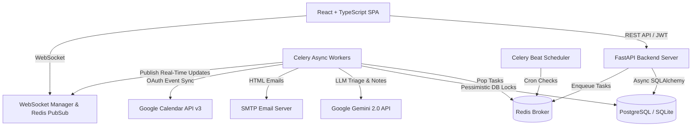

# HealthCare Appointment & Follow-Up Manager — Technical System Architecture

## 1. Architectural Overview

The HealthCare Appointment & Follow-up Manager is an asynchronous, event-driven, full-stack healthcare platform designed to solve double-booking race conditions, simplify medical consultation workflows using Google Gemini 2.0 AI summaries, and synchronize patient notifications across Email, Google Calendar, and WebSockets.



---

## 2. Core Architectural Subsystems

### 2.1 Dual-Dialect Pessimistic Locking Engine
* **Problem**: Simultaneous slot reservation attempts by multiple patients lead to catastrophic double-booking race conditions.
* **Implementation** (`server/services/slot_service.py`):
  * **PostgreSQL Engine**: Uses `SELECT FOR UPDATE SKIP LOCKED` or `FOR UPDATE` inside an isolated transaction.
  * **SQLite Engine**: Falls back to serialized read-and-lock status checks with `hold_expires_at` validation.
  * **5-Minute Temporary Slot Hold**: Reserving a slot creates an appointment with `HELD` status and `hold_expires_at = now() + 5 minutes`. If unconfirmed within 5 minutes, Celery Beat automatically releases the slot back to available status.

### 2.2 Google Gemini 2.0 LLM Pipeline & Fallback Architecture
* **Pre-Visit Symptom Triage**:
  * Evaluates chief complaint, duration, severity, and medical history.
  * Generates structured JSON output with `urgency_level` (`LOW`, `MEDIUM`, `HIGH`), chief complaint summary, and 3 suggested clinical questions for the physician.
* **Post-Visit Patient Summary & Medication Extraction**:
  * Transforms complex clinical notes into patient-friendly 6th-grade reading level instructions.
  * Automatically extracts structured medication schedules (`medication_name`, `dosage`, `frequency`, `duration_days`).
* **Resilience & Fallback Strategy**:
  * Implements exponential backoff retry with jitter (`google.api_core.exceptions.GoogleAPIError`).
  * If the LLM API is unavailable or returns malformed JSON, a deterministic rule-based fallback generator takes over, ensuring 0% API failure impact on critical healthcare operations.

### 2.3 Async Task Queue & Real-Time WebSockets
* **Celery Workers & Beat Scheduler**:
  * Worker thread pools bridge async SQLAlchemy tasks via an asyncio event loop runner (`run_async()`).
  * Celery Beat executes cron tasks every minute:
    * Expired slot hold release.
    * 24-hour appointment reminder dispatch via email and Google Calendar update.
    * Scheduled medication daily reminders.
* **Multi-Channel Notification Orchestrator**:
  * Dispatches HTML emails rendered via `fastapi-mail` and Jinja2 templates.
  * Syncs events with Google Calendar via OAuth 2.0 tokens (`google-auth-oauthlib`).
  * Broadcasts real-time WebSocket state changes to frontend connected clients.

---

## 3. Database Schema Overview

```
User (id, email, password_hash, role [PATIENT, DOCTOR, ADMIN], google_tokens)
  └── DoctorProfile (id, user_id, specialisation, working_hours [JSON], slot_duration_minutes, is_active)
        ├── DoctorLeave (id, doctor_id, leave_date, reason)
        └── Appointment (id, patient_id, doctor_id, slot_start, slot_end, status [HELD, CONFIRMED, COMPLETED, CANCELLED])
              ├── SymptomForm (id, appointment_id, symptoms_text, pre_visit_summary [JSON], urgency_level)
              └── PostVisitNote (id, appointment_id, doctor_notes, prescription_text, patient_summary [JSON])
                    └── MedicationReminder (id, patient_id, medication_name, dosage, frequency, reminder_time)
```
